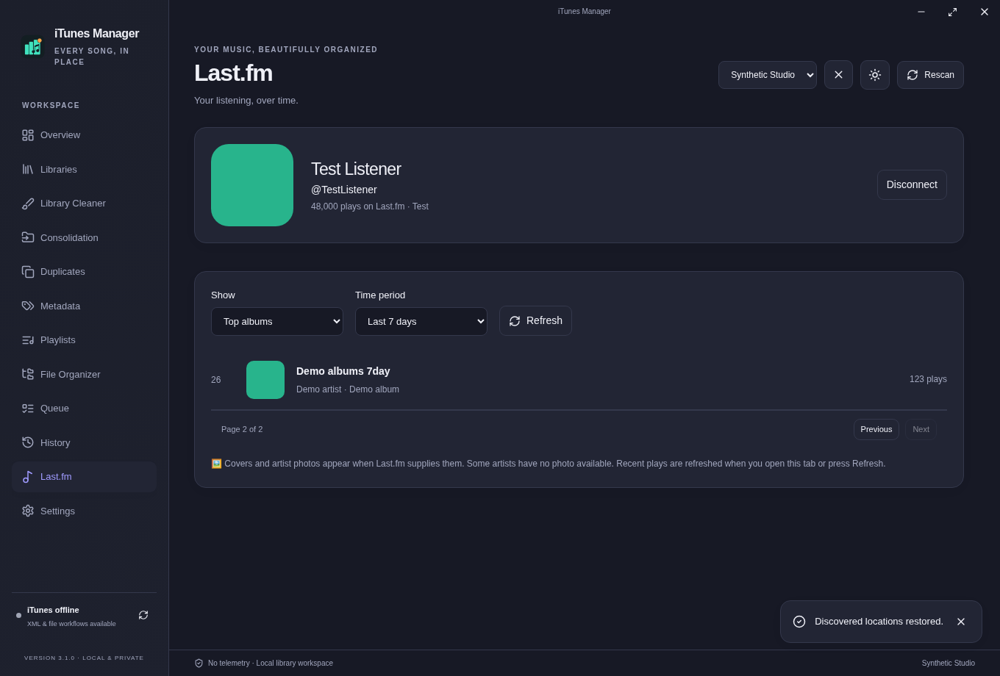

# 🎧 Last.fm listening

## 🔑 Connect

1. Open **Last.fm** in the sidebar.
2. Choose **Get a Last.fm API key**, or visit [Last.fm’s API page](https://www.last.fm/api/account/create). Last.fm may ask you to sign in there.
3. Enter the API key and the username whose public listening history you want to view.
4. Choose **Connect Last.fm**. A successful connection shows the username, profile picture when available, and total plays.

You need the **API key**, not the shared secret or your account password. A key identifies an API application, not a person. The username chooses the account. This app checks both with Last.fm before saving the connection.

## 📊 Explore your listening

- **Recently played:** recent songs and any track marked as playing now.
- **Top songs, artists and albums:** choose all time, 7 days, 1 month, 3 months, 6 months or 1 year.
- Use **Previous** and **Next** to browse more results. **Refresh** asks Last.fm for fresh data.
- Album covers and artist photos appear when Last.fm provides them. For top songs without a cover, the app asks Last.fm for the album image. Missing pictures keep a simple fallback.

Recent plays refresh when you open the tab. Chart responses are cached briefly to avoid repeated requests. The app limits picture requests so they do not crowd out library work.

## 🛡️ Privacy and limits

This is a read-only connection. It does not scrobble, change your Last.fm account, or sign you in to the Last.fm website. It does not upload your local library. Private listening data that needs account authorization is not supported.

The API key is stored in the local app database, separate from general preferences. It is not returned to the interface or included in the app’s exported reports. The local database is not encrypted; protect your Windows account and app-data backups. **Disconnect** removes the saved key and clears the Last.fm caches without changing the account’s history.

Internet access to `ws.audioscrobbler.com` and Last.fm image hosts is required. Invalid keys, missing users, private data, rate limits and service outages show a clear error. Some Last.fm APIs return placeholder artist images; those are hidden rather than shown as photos. An API key and username cannot grant access to private account data.

## 🖼️ Layout preview

This screenshot uses generated listening data and test pictures, not a real Last.fm account.

